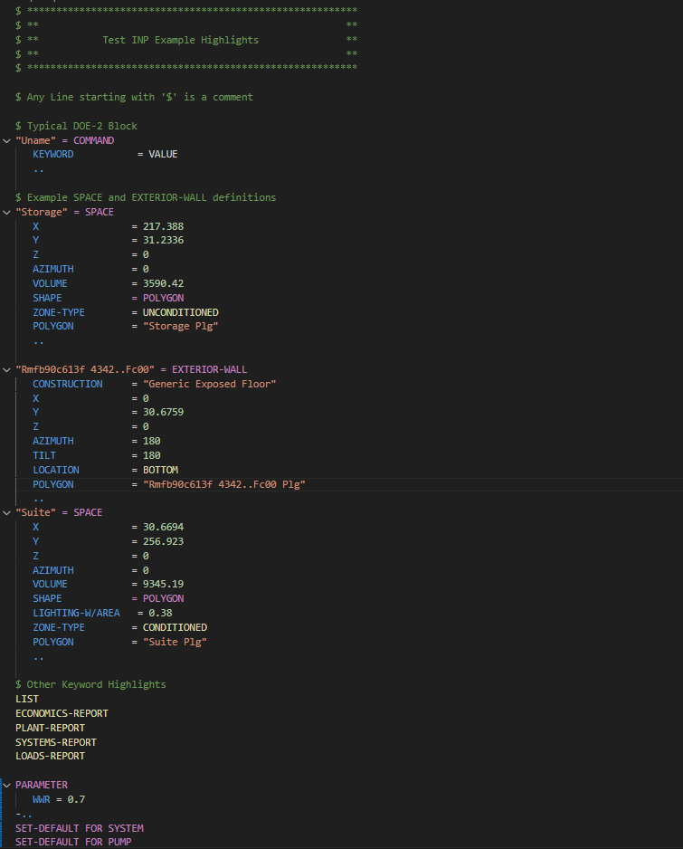

# BDL (DOE‑2) syntax highlighting for `.inp`

This is a VS code highlighting extension for DOE‑2 / eQUEST inp files

## Highlights

Once installed verify it is working by opening the 'test-sample.inp' file and it should look like:



## Use it
1. Install the packaged `.vsix` or open this folder and run an Extension Development Host.
2. Open a `.inp` file — the language activates automatically.
3. Optional: switch to the “BDL Color Theme” from the Command Palette.

## Notes
- Only `$` starts a comment line
- The grammar is intentionally small and fast; extend `syntaxes/bdl.tmLanguage.json` if you need more keywords.

## Files
```
├─ package.json
├─ language-configuration.json
├─ syntaxes/bdl.tmLanguage.json
└─ themes/bdl-color-theme.json
```
## Contributing
Fork the repository, make your changes, and open a pull request if you'd like to add keywords or create custom themes.

## License

Licensed under the MIT License.
